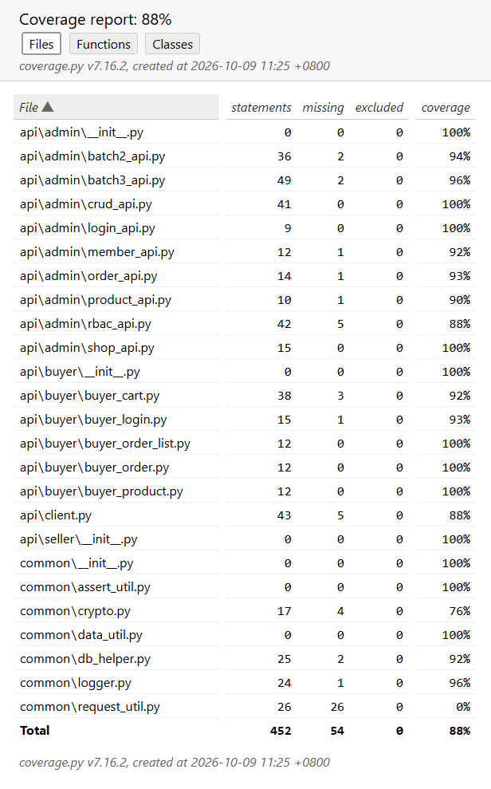
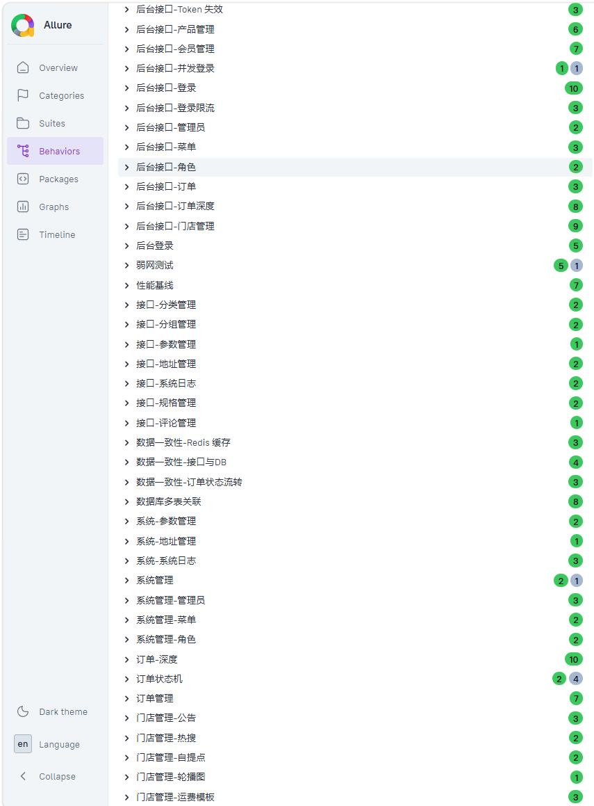

# Mall4j UI + API 自动化测试

> 基于 Playwright + Pytest + JMeter 的电商系统双端三轨自动化测试项目


---

## 项目简介

针对本地部署的 Mall4j 电商系统（Spring Boot 4 + Vue3 + Uniapp）构建的自动化测试项目，覆盖**管理员后台 + 买家端双端**，**API + UI + 性能**三轨，合计 **236 条**用例。

- **双端覆盖**：管理员后台（8085）+ 买家端（8086）
- **三轨架构**：API + UI + JMeter 性能压测
- **完整链路**：买家端打通"逛 → 加 → 下单 → 查订单"用户旅程
- **接口 + DB 双重断言**：直连 MySQL 验证数据真的落库
- **多维度验证**：契约 + 性能 + 边界值 + 安全 + 并发 + 幂等 + 导出
- **覆盖率 93%**：基于 pytest-cov 统计
- **JMeter 三档梯度压测**：50/100/200 并发，发现商品列表接口性能拐点
- **完整运维体系**：WSL2 Shell + crontab + Windows 任务计划程序
- **发现 4 个真实缺陷**：P0 × 1，P1 × 2，P2 × 1

---

## 核心亮点

### 1. 双端三轨架构

```bash
pytest -m ui           # UI 用例
pytest -m api          # 接口用例
pytest testcases/      # 全跑
jmeter -n -t scripts/jmeter/mall4j_homepage.jmx  # 性能压测
```

### 2. 买家端完整链路

覆盖 8086 前台用户 API，打通买家完整用户旅程：

- **登录**：AES 加密密码，复用管理员端加密工具
- **商品浏览 + 搜索**：按标签查列表 + 关键词搜索
- **购物车 CRUD**：加购、累加、删除
- **下单**：确认 → 提交 → DB 双重断言
- **订单查询**：列表 + 详情
- **异常**：加购超库存、未登录鉴权
- **边界值**：超长文本、SQL 注入、XSS、Emoji、特殊字符
- **安全**：XSS 注入、Token 失效、IDOR 越权
- **并发**：10 线程抢 1 库存
- **幂等性**：重复提交订单只创建 1 个

### 3. JMeter 三档梯度压测

| 并发 | 请求数 | 错误率 | P99 | 吞吐量 |
|---|---|---|---|---|
| 50 | 1500 | 0% | 17ms | 152/s |
| 100 | 3000 | 0% | 16ms | 298/s |
| 200 | 6000 | 0% | 608ms | 497/s |

发现：200 并发下商品列表 P99 涨 26 倍，有独立性能瓶颈。

### 4. 测试环境运维体系

- WSL2 Shell 脚本：备份 / 巡检 / 日志轮转
- 定时任务：WSL2 crontab + Windows 任务计划程序（双方案实测）

### 5. 测试覆盖率 93%



### 6. 已发现缺陷

| ID | 描述 | 严重程度 |
|---|---|---|
| BUG-001 | 发货接口缺少订单状态校验 | P0 |
| BUG-002 | 登录成功后不清除密码错误计数 | P2 |
| BUG-003 | 断网时前端无网络异常提示 | P1 |
| BUG-004 | 后端对 Emoji 处理异常 | P1 |

---

## 测试报告

### Allure 总览（236 条用例，100% 通过）


### 按模块分组（Behaviors）



### 覆盖率报告（93%）


### JMeter 200 并发压测


---

## 测试覆盖

| 轨道 | 模块 | 用例数 |
|---|---|---|
| API | 管理员后台 | 123 |
| API | 买家端 | 31 |
| UI | 管理员后台 | 73 |
| UI | 买家端 | 3 |
| 单元 | AES 加密 | 9 |
| **合计** | | **236** |

---

## 技术栈

| 工具 | 用途 |
|---|---|
| Python 3.11 | 编程语言 |
| Playwright | UI 自动化 + CDP 弱网 |
| Pytest + xdist | 测试框架 |
| Requests | 接口测试 |
| PyMySQL | DB 断言 |
| PyCryptodome | AES 加密 |
| jsonschema | 契约测试 |
| Redis-py | 缓存测试 |
| openpyxl | Excel 导出解析 |
| pytest-cov | 覆盖率 |
| JMeter 5.6.3 | 性能压测 |
| WSL2 + Bash | 运维脚本 |
| Allure | 测试报告 |

---

## 项目结构

```
mall4j-ui-api-autotest/
├── config/              # 全局配置
├── common/              # 日志/DB/加密
├── pages/               # POM 页面对象
│   ├── admin/
│   ├── buyer/
│   └── seller/
├── api/                 # 接口封装
│   ├── admin/
│   ├── buyer/
│   ├── seller/
│   └── client.py
├── schemas/             # JSON Schema
├── testcases/
│   ├── test_unit/
│   ├── test_ui/
│   └── test_api/
├── scripts/             # 运维脚本
│   ├── shell/
│   └── jmeter/
├── docs/
├── screenshots/
└── conftest.py
```

---

## 快速开始

### 前置条件

1. Mall4j（MySQL 3307 + Redis 6379 + 后端 8085/8086 + 前端 9527/80）
2. Python 3.11+
3. JMeter 5.6.3+
4. WSL2 Ubuntu

### 一键启动

```powershell
.\scripts\start_all.ps1
```

### 安装

```powershell
python -m venv venv
venv\Scripts\activate
pip install -r requirements.txt
playwright install chromium firefox
```

### 运行

```bash
# 全部
pytest testcases/ -v

# 接口
pytest testcases/test_api/ -q --ignore=testcases/test_api/admin/test_zzz_login_rate_limit.py

# UI
pytest testcases/test_ui/ -q

# 覆盖率
pytest testcases/test_api/ --cov=api --cov=common --cov-report=html

# Allure
pytest testcases/ --alluredir=reports/allure-results
allure serve reports/allure-results
```

### 运维

```bash
cd /mnt/e/mall4j-ui-api-autotest/scripts/shell
./check_env.sh       # 环境巡检
./backup_mall4j.sh   # 数据库备份
./rotate_logs.sh     # 日志轮转
```

---

## 买家端测试数据恢复

Mall4j 库存分两层，恢复时需同时改两张表：

```sql
USE yami_shops;
UPDATE tz_prod SET total_stocks = 1000 WHERE prod_id = 75;
UPDATE tz_sku SET stocks = 1000, actual_stocks = 1000 WHERE sku_id = 402;
DELETE FROM tz_basket WHERE user_id = '51540df5255e4d22903b0f83921095ff';
```

清 Redis：

```powershell
python -c "import redis; redis.Redis(host='127.0.0.1', port=6379, db=0, protocol=2).flushdb()"
```

---

## Let's Connect

- GitHub: [@StillStream-ink](https://github.com/StillStream-ink)
