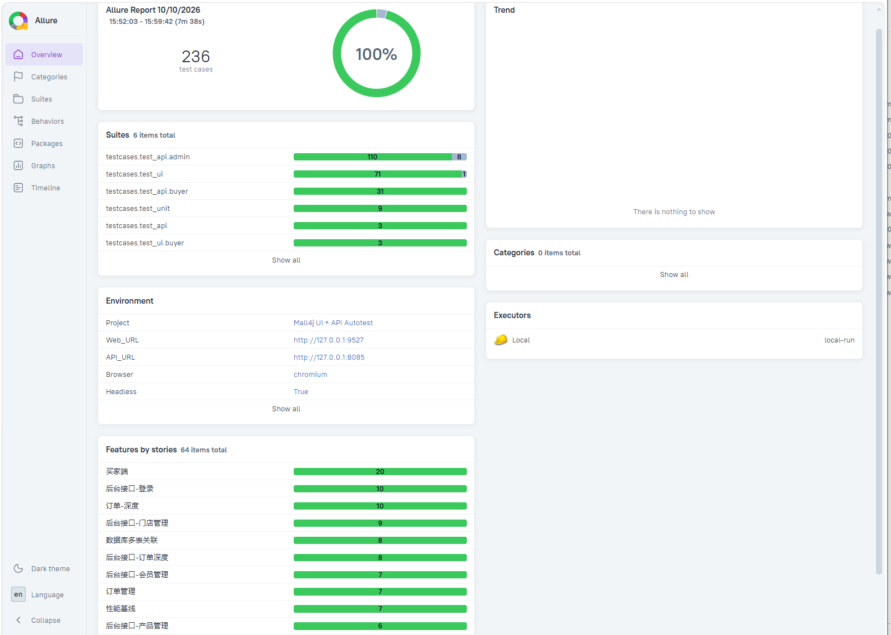
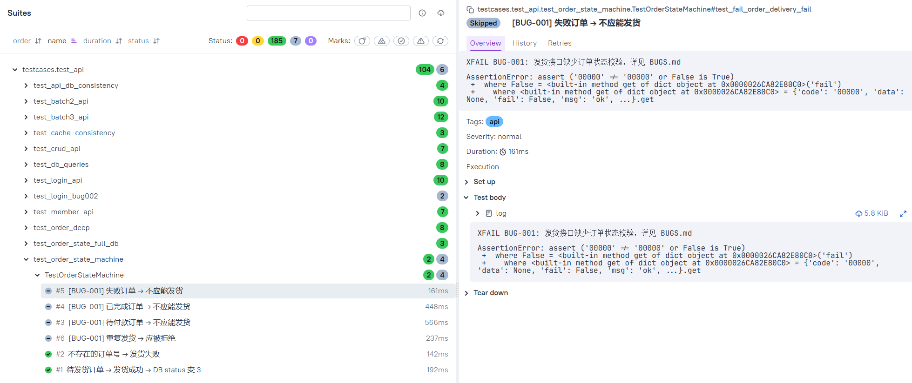

# Mall4j UI + API 自动化测试

> 基于 Playwright + Pytest 的电商系统双轨自动化测试项目

---

## 项目简介

针对本地部署的 Mall4j 电商系统（Spring Boot 4 + Vue3）构建的自动化测试项目。

- UI 与 API 双轨架构，共用配置、日志、报告、通知
- 数据驱动 + 契约 + 性能三重验证
- 接口 + 数据库双重断言，穿透到数据层验证一致性
- 数据工厂自建自清，不依赖手工造数据
- 弱网 + 兼容性 + RBAC + 缓存一致性 + 多表关联专项测试
- 通过订单状态机、限流、弱网测试发现 3 个真实缺陷

---

## 核心亮点

### 1. UI + API 双轨架构

同一工程内两条独立测试轨道，共用配置、日志、报告、通知。
pytest -m ui # 只跑 UI
pytest -m api # 只跑接口
pytest -m weaknetwork # 只跑弱网
pytest -m compatibility # 只跑兼容性
pytest -m performance # 只跑性能基线
pytest testcases/ # 全跑

### 2. 三层验证：数据驱动 + 契约 + 性能

- **数据驱动矩阵**：1 条方法覆盖 10 个登录场景
- **JSON Schema 契约**：后端改字段名立即失败
- **性能基线**：7 个核心接口响应 < 1s

### 3. AES 加密复现

分析前端 JS 加密逻辑，用 Python 复现 AES/ECB/Pkcs7，真实模拟客户端登录。

### 4. 数据工厂

基于 pytest fixture 自动构建和恢复测试数据，不污染环境。

### 5. 接口 + DB 双重断言

不只校验接口返回，直连 MySQL 验证数据真的落库：

    assert resp.json()["code"] == "00000"        # 接口层
    row = db.query_one("SELECT status FROM tz_order WHERE order_number=%s", (no,))
    assert row["status"] == 3                    # 数据库层

### 6. 专项测试

- **弱网**：CDP 模拟 3G / 2G / 断网
- **兼容性**：Chromium / Firefox / WebKit + 3 分辨率
- **RBAC 权限**：受限角色 + 用户 + 菜单隔离
- **Redis 缓存**：token 落 Redis、TTL、key 变更
- **数据一致性**：CRUD 后 DB 校验、订单全字段
- **多表关联**：订单金额 = SUM(订单项)、孤儿记录巡检

### 7. 已发现缺陷

| ID | 描述 | 严重程度 |
|---|---|---|
| [BUG-001](./docs/BUGS.md) | 发货接口缺少订单状态校验 | P0 |
| [BUG-002](./docs/BUGS.md) | 登录成功后不清除密码错误计数 | P2 |
| [BUG-003](./docs/BUGS.md) | 断网时前端无网络异常提示 | P1 |

### 8. Linux 运维脚本

3 个版本的环境检查脚本，适配不同平台：

| 脚本 | 平台 | 用途 |
|---|---|---|
| `scripts/check_env.sh` | Linux | 生产环境检查 |
| `scripts/check_env.ps1` | Windows | PowerShell 检查 |
| `scripts/check_env.py` | 跨平台 | Python 通用版 |

其他脚本：`tail_logs.sh`（日志）、`clean_test_data.sh`（数据清理）、`batch_test.sh`（批量+归档）。

---

## 测试报告

### Allure 总览（197 条用例）

### 用例详情

---

## 测试覆盖

| 轨道 | 模块 | 用例数 |
|---|---|---|
| API | 登录 / 产品 / 会员 / 门店 / 订单 / 系统管理 | 110 |
| UI | 登录 / 产品 / 会员 / 门店 / 订单 / 系统管理 | 73 |
| 单元 | AES 加密函数 | 9 |
| **合计** | **6 大模块 + 30 子功能** | **192** |

---

## 技术栈

| 工具 | 用途 |
|---|---|
| Python 3.11 | 编程语言 |
| Playwright | UI 自动化 + CDP 弱网模拟 |
| Pytest + pytest-xdist | 测试框架 + 并行 |
| Requests | 接口测试 |
| PyMySQL | 数据库直连断言 |
| PyCryptodome | AES 加密 |
| jsonschema | 契约测试 |
| Redis-py | 限流 + 缓存测试 |
| Allure | 测试报告 |

---

## 项目结构

    mall4j-ui-api-autotest/
    ├── config/              # 全局配置
    ├── common/              # 日志 / DB / 请求封装
    ├── pages/               # UI 页面对象（POM）
    ├── api/                 # 接口封装
    ├── schemas/             # JSON Schema 契约
    ├── testcases/
    │   ├── test_unit/       # 单元测试
    │   ├── test_ui/         # UI 用例
    │   └── test_api/        # 接口用例
    ├── scripts/             # 运维脚本
    ├── docs/                # 附加文档
    ├── screenshots/         # 报告截图
    ├── conftest.py          # 全局 Fixture
    ├── pytest.ini           # Pytest 配置
    ├── send_feishu.py       # 飞书通知
    ├── run_all_tests.bat    # 一键运行
    ├── BUGS.md              # 缺陷记录
    ├── TEST_CASES.md        # 用例总表
    ├── ARCHITECTURE.md      # 架构文档
    └── requirements.txt

---

## 快速开始

### 前置条件

1. 本地部署 Mall4j（MySQL 3307 + Redis 6379 + 后端 8085/8086 + 前端 9527）
2. Python 3.11+
3. Allure 命令行工具

### 安装

    git clone https://github.com/StillStream-ink/mall4j-ui-api-autotest.git
    cd mall4j-ui-api-autotest
    python -m venv venv
    venv\Scripts\activate
    pip install -r requirements.txt
    playwright install chromium firefox

### 配置 .env

    FEISHU_WEBHOOK=https://open.feishu.cn/open-apis/bot/v2/hook/你的地址

### 运行

    # 全部用例
    pytest testcases/ -v

    # 只跑接口
    pytest testcases/test_api/ -q --ignore=testcases/test_api/test_zzz_login_rate_limit.py

    # 只跑 UI
    pytest testcases/test_ui/ -q

    # 只跑单元
    pytest testcases/test_unit/ -q

    # 生成 Allure 报告
    pytest testcases/ --alluredir=reports/allure-results
    allure serve reports/allure-results

    # 一键跑 + 飞书通知
    run_all_tests.bat

---

## Let's Connect

- GitHub: [@StillStream-ink](https://github.com/StillStream-ink)
- Email: your_email@example.com