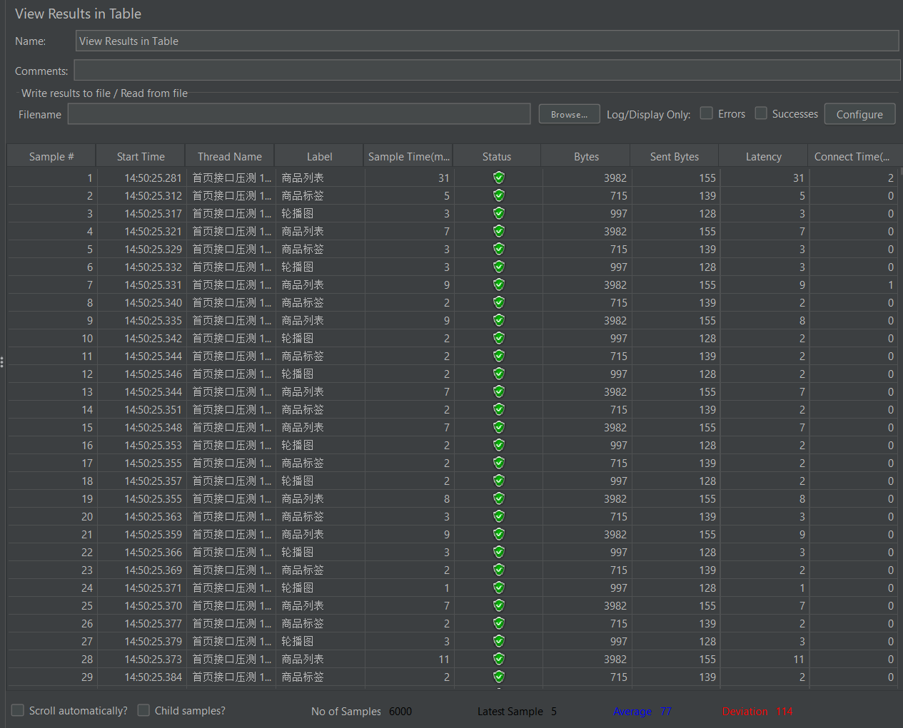

# 架构设计文档

## 1. 分层架构

    config/       全局配置（URL、账号、DB、超时）
    common/       日志、DB 连接、请求工具
    pages/        UI 页面对象（POM）
    api/          接口封装
    schemas/      JSON Schema 契约定义
    testcases/    用例（只做断言）

**核心原则**：用例层不碰页面元素，页面层不碰 HTTP 请求。

---

## 2. UI + API 双轨设计

**为什么不是两个独立项目？**

- 共用配置：URL、账号一处修改全局生效
- 共用工具：日志、报告、通知
- 互相配合：接口造数据 → UI 验证界面

**物理隔离**：

    pytest -m ui      # 只跑 UI
    pytest -m api     # 只跑接口

---

## 3. 数据工厂

订单状态机测试需要不同状态的订单，但数据库只有"已完成"和"失败"。

**解决方案**：fixture 临时改 DB 状态，测完自动恢复。

    @pytest.fixture
    def order_with_status(db):
        original = []
        def _set(order_number, status):
            row = db.query_one("SELECT status FROM tz_order WHERE order_number=%s", (order_number,))
            original.append((order_number, dict(row)))
            db.execute("UPDATE tz_order SET status=%s WHERE order_number=%s", (status, order_number))
        yield _set
        for order_number, row in original:
            db.execute("UPDATE tz_order SET status=%s WHERE order_number=%s", (row["status"], order_number))

**关键点**：
- 不依赖手工造数据
- 每条用例自建自清
- 失败时也能恢复（fixture teardown）

---

## 4. 接口 + DB 双重断言

**接口返回成功 ≠ 数据真的落库。**

本项目：

    assert resp.json()["code"] == "00000"
    row = db.query_one("SELECT status, dvy_time FROM tz_order WHERE order_number=%s", (order_number,))
    assert row["status"] == 3
    assert row["dvy_time"] is not None

**踩坑记录**：
- pymysql 默认 `autocommit=False`
- 事务隔离级别 `REPEATABLE READ`
- 首次 SELECT 后，后续查询读到旧快照
- **解决**：`autocommit=True`

---

## 5. 三层验证：数据驱动 + 契约 + 性能

### 数据驱动矩阵

    @pytest.mark.parametrize("username, password, expect_success, case_name", [
        ("admin", "123456", True, "正常登录"),
        ("admin", "wrong_pwd", False, "错误密码"),
        ("", "123456", False, "空用户名"),
        ("admin' OR '1'='1", "123456", False, "SQL 注入"),
        # ...
    ])

一条方法覆盖 10 场景，等价类 + 边界值 + 安全测试。

### JSON Schema 契约测试

后端改字段名会立即失败，比普通断言更早发现问题。

### 性能基线

关键接口响应时间 < 1s 断言。

---

## 6. 专项测试设计

### 弱网测试

Playwright + CDP 模拟网络条件：

    cdp = page.context.new_cdp_session(page)
    cdp.send("Network.emulateNetworkConditions", {
        "offline": False,
        "latency": 400,
        "downloadThroughput": 400 * 1024 / 8,
        "uploadThroughput": 400 * 1024 / 8,
    })

**覆盖**：3G 慢网、断网登录、断网恢复。

**局限**：本地 CDP 不走真实网络，无法复现 TCP 握手超时、丢包重传。

### 兼容性测试

通过 `BROWSER` 环境变量切换引擎：

    $env:BROWSER="chromium"; pytest testcases/test_ui/test_compatibility.py -v
    $env:BROWSER="firefox";  pytest testcases/test_ui/test_compatibility.py -v
    $env:BROWSER="webkit";   pytest testcases/test_ui/test_compatibility.py -v

**WebKit 限制**：Windows 下无法访问 localhost Vite 开发服务器（Playwright 已知问题），用 `@pytest.mark.skipif` 标记。

### RBAC 权限测试

创建受限角色（仅 1 个菜单）→ 创建用户绑定 → 新用户登录 → 验证菜单隔离。

### Redis 缓存测试

验证 token 落 Redis、TTL、key 变更。

**踩坑**：redis-py 5.x 默认 RESP3 协议（HELLO 命令），Redis 5.0 不支持，需 `protocol=2`。

---

## 7. 缺陷管理

### BUG-001：发货接口缺少订单状态校验（P0）

**发现过程**：
1. 设计 6 条状态机用例
2. 4 条失败：待付款 / 已完成 / 失败 / 重复发货全部成功
3. 查看后端源码，定位到 `OrderController.delivery()` 缺少状态校验
4. 用 `@pytest.mark.xfail` 标记对应用例

### BUG-002：登录成功后不清除错误计数（P2）

**发现过程**：
1. 做限流测试，原以为"错误 10 次锁定"
2. 查看 `PasswordCheckManager.java` 发现 `count > 10`，实际第 12 次才锁
3. 进一步发现代码没有"登录成功清除计数"的逻辑

### BUG-003：断网时前端无异常提示（P1）

**发现过程**：
1. 弱网测试探底，CDP 模拟断网
2. 断网点登录，错误提示数量 = 0
3. 查看 `http.js` 响应拦截器：`switch (error.response.status)` 断网时 `error.response` 为 undefined 抛 TypeError

---

## 8. 并行执行的理性决策

**尝试**：`pytest-xdist -n 4`。

**实测**：串行 6.47s → 并行 5.19s，收益 1.28s。

**结论**：
- 接口测试本身很快，并行收益有限
- UI 测试不能简单并行（浏览器上下文冲突）
- 最终方案：接口 4 worker 并行 + UI 串行

---

## 9. 失败处理

- **失败自动截图**：`pytest_runtest_makereport` hook
- **环境信息自动生成**：Allure 报告自动带 `environment.properties`
- **飞书通知**：跑完自动推送卡片
- **xfail 标记**：已知缺陷，开发修复后去掉标记即可回归

---

## 10. 关键设计决策

| 决策 | 方案 A | 方案 B | 最终选择 | 理由 |
|---|---|---|---|---|
| 双轨 vs 两项目 | 两独立仓库 | 同工程双轨 | 双轨 | 共用配置/报告/通知 |
| 并行执行 | 全并行 | 接口并行+UI串行 | 接口并行 | UI 有浏览器状态冲突 |
| 数据准备 | 手工 SQL | Fixture 工厂 | Fixture | 自建自清，不污染环境 |
| 弱网测试 | 全浏览器 | 仅 Chromium | 仅 Chromium | CDP 只在 Chromium 可用 |
| WebKit 兼容 | 报错 | skip | skip | Windows 环境限制 |
| DB 断言 | 只看接口 | 接口+DB双重 | 双重 | 接口成功 ≠ 数据落库 |

---

## 11. 运维脚本设计

项目提供 6 个脚本：

| 脚本 | 平台 | 功能 |
|---|---|---|
| `check_env.sh` | Linux | 环境检查 |
| `check_env.ps1` | Windows | PowerShell 版本 |
| `check_env.py` | 跨平台 | Python 版本 |
| `tail_logs.sh` | Linux | 日志实时查看 |
| `clean_test_data.sh` | Linux | 数据清理 |
| `batch_test.sh` | Linux | 批量跑 + 归档 |

详见 [docs/LINUX_OPS.md](./docs/LINUX_OPS.md)。

---

---

## 12. 买家端架构

买家端覆盖 8086 前台用户 API，与管理员端共用同一套框架：

    api/
    ├── admin/           # 管理员端（8085）
    ├── buyer/           # 买家端（8086）
    │   ├── buyer_login.py        # AES 加密登录
    │   ├── buyer_product.py      # 商品浏览/搜索
    │   ├── buyer_cart.py         # 购物车 CRUD
    │   ├── buyer_order.py        # 确认/提交订单
    │   └── buyer_order_list.py   # 订单列表/详情
    ├── seller/          # 卖家端（待扩展）
    └── client.py        # 公共 HTTP 客户端

**关键差异**：

| 维度 | 管理员端 | 买家端 |
|---|---|---|
| 端口 | 8085 | 8086 |
| 登录加密 | AES | AES（复用同一工具） |
| Token 头 | Authorization | Authorization |
| 主要表 | tz_order / tz_sys_config | tz_order / tz_basket / tz_prod |

**买家端完整链路**：

    登录 → 浏览商品 → 加购 → 确认订单 → 提交订单 → DB 断言
                                        ↓
                                  订单列表 → 订单详情

**环境自动恢复 fixture**：

    @pytest.fixture(scope="session", autouse=True)
    def restore_buyer_test_env():
        # 恢复 prod 75 / sku 402 库存
        # 清 Redis 缓存
        ...

**踩坑记录**：

- Mall4j 库存分两层：`tz_prod.total_stocks`（下单校验用）、`tz_sku.actual_stocks`（SKU 展示用）。改库存时两张表都要改，否则下单一直报"库存不足"。
- `changeItem` 是**累加**语义，不是设置。传 count=1 是"在原数量上再加 1"，不是"设为 1"。
- Emoji 输入问题（BUG-004）：表级 utf8mb3 导致 4 字节字符无法存储，搜索接口和系统参数接口均返回 A00005。
- Windows 文件锁：openpyxl 打开临时 xlsx 后 os.unlink 会报 PermissionError（文件句柄未释放），改成不主动删。
- 并发加购：Mall4j 加购阶段不扣库存，有并发保护（无超卖），但并发冲突返回 A00005 而非友好提示。
- 幂等性：Mall4j 用"预订单一次性消费"实现下单幂等，重复提交第 2 次被拒，DB 只 +1 个订单。

---

## 13. JMeter 性能压测

**脚本**：`scripts/jmeter/mall4j_homepage.jmx`

**测试对象**：首页 3 个核心接口

| 接口 | 路径 |
|---|---|
| 商品列表 | /prod/prodListByTagId?tagId=1&size=10 |
| 商品标签 | /prod/tag/prodTagList |
| 轮播图 | /indexImgs |

**压测策略**：梯度加压 50 / 100 / 200 并发，Ramp-up 10-20 秒，每档 Loop 10 次。

**结果**：

| 并发 | 请求数 | 错误率 | 平均 | P95 | P99 | 吞吐量 |
|---|---|---|---|---|---|---|
| 50 | 1500 | 0% | 4ms | 9ms | 17ms | 152/s |
| 100 | 3000 | 0% | 5ms | 12ms | 16ms | 298/s |
| 200 | 6000 | 0% | 77ms | 278ms | 608ms | 497/s |

**单接口对比（200 并发）**：

| 接口 | 平均 | P95 | P99 | 最大 | 错误率 |
|---|---|---|---|---|---|
| 商品列表 | 193ms | 497ms | 677ms | 783ms | 0% |
| 商品标签 | 19ms | 48ms | 104ms | 268ms | 0% |
| 轮播图 | 20ms | 49ms | 109ms | 245ms | 0% |

**关键发现**：

1. 100 并发前性能线性，200 并发时商品列表接口出现性能拐点
2. 商品列表 P99 从 26ms 劣化到 677ms（涨 26 倍），其他两个接口只涨 17-18 倍
3. 推测商品列表涉及多表 JOIN（tz_prod + tz_sku + tz_shop_detail），需要 SQL 执行计划分析

**报告截图**：

---

## 14. 测试环境运维体系

**脚本目录**：`scripts/shell/`

| 脚本 | 用途 |
|---|---|
| `backup_mall4j.sh` | mysqldump 整库备份，保留最近 30 天 |
| `check_env.sh` | 一键巡检 6 项（4 端口 + MySQL + Redis + 备份 + JMeter + 磁盘） |
| `rotate_logs.sh` | 7 天前日志自动压缩，30 天前归档删除 |

**运行环境**：WSL2 Ubuntu（通过 Windows 局域网 IP 访问宿主机服务）

**定时任务**：

| 方案 | 配置 | 用途 |
|---|---|---|
| WSL2 crontab | 每日 2 点备份 / 周日 3 点轮转 / 每日 9 点巡检 | WSL2 常驻时执行 |
| Windows 任务计划程序 | Mall4j-DailyBackup 每日 2 点 | WSL2 关闭时兜底 |

**为什么两套**：WSL2 关闭后 crontab 不跑，生产环境必须用 Windows 任务计划程序调用 `wsl -d Ubuntu -- bash -c "..."` 兜底。

**巡检输出示例**：

    ==========================================
      Mall4j 环境健康巡检
    ==========================================
    【1. 服务端口检查】
      ✅ 买家端 API      (8086) 正常
      ✅ 管理员端 API    (8085) 正常
      ✅ 买家端 H5       (80) 正常
      ✅ 管理员端 Vue    (9527) 正常
    【2. MySQL 数据库检查】
      ✅ MySQL 连接正常
      📊 yami_shops 表数量: 43
      📦 订单总数: 50
    【3. Redis 缓存检查】
      ℹ️  Redis 仅监听 127.0.0.1（WSL2 无法直连，符合安全最佳实践）
    【4. 备份文件检查】
      ✅ 最新备份: yami_shops_20261009_160300.sql (572K)
    【5. 磁盘空间检查】
      💾 E 盘使用率: 8%
    ==========================================

**运维体系的价值**：

- **数据污染**：自动化测试持续写入数据 → 每日备份 + 快速恢复
- **环境失察**：不知道服务是否健康 → 每日巡检 + 结构化报告
- **日志堆积**：测试日志越来越大 → 自动轮转 + 归档清理
